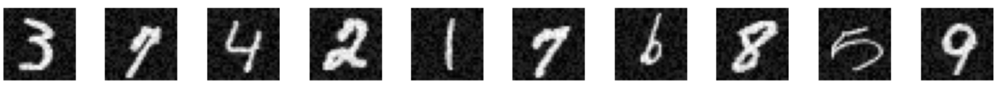

# Kernel Methods

Kernel Methods are a class of algorithms to tackle unsupervised and supervised learning in nonlinear problems. The idea is to map the data from the feature space, to a special kind of Hilbert Space, a Reproducing Kernel Hilbert Space, by the means of a positive-definite kernel. This famework has the extraordinary
property to leverage any algorithm based on a linear model (Linear Ridge Regression, SVM, PCA...) to its non-linear counterpart.

The notebook above displays some simple academic examples to illustrate what can be done when the data does not possess any linear feature.

A smart combination of these methods can even lead to a simple denoiser, see below.

## Denoising

We can build a small autoencoder for denoising with simply Kernel PCA and Multivariate Kernel Ridge Regression(MKRR) algorithms.

### Encoder
Kernel PCA plays the role of the encoder. 

For the training stage:
It computes the Gram matrix of a MNIST, and find the eigenvectors associated to the largest eigenvalues (also called the principal components).

For the test stage:
It computes the projection of the MNIST along the principal components. The raw quantity of information is drastically reduced, this is the so-called latent space.

### Decoder
MKRR plays the role of the decoder.

For the training phase:
It calculates the optimal coefficients of the ridge regression.

For the test phase:
It reconstructs the whole MNIST by regression, knowing only its principal components.

### Results
To sum up, the denoiser works as follows. Put the noisy MNIST into the encoder to project it along the principal components. Then, the decoder maps those components to the whole data matrix. 

The key idea is to discard the noisy features when projecting the MNIST along the principal components, while keeping the information related to the digit. So, the trick is to choose the right number of principal components,
enough to store what digit is represented, but not too much to set off the noise.

As usual, there is a training phase followed by a testing phase. 

The test dataset is simply made by adding a uniform pixel-wise noise to some clean MNIST.

Below is the result after training for different levels of noise.

- 0%:
 
 

- 20%:
 
 

- 50%:
 
 

- 70%:
 
 

- 100%:
 
 

From what I could experiment, when the level of noise is low, a small regularization parameter and decoder's variance is better.
On the opposite, a large regularization parameter and decoder's variance is better when there is a large amount of noise in the data.