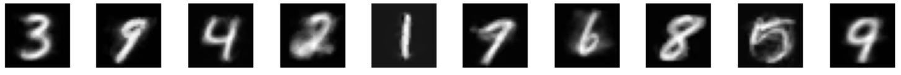

# Kernel Methods

Kernel Methods are a class of algorithm to tackle non-linear problems. The idea is to map the data from the feature space, to a special kind of Hilbert Space, a Reproducing Kernel Hilbert Space, by the means of a positive-definite kernel. This famework has the extraordinary
property to leverage any algorithm based on a linear model (Linear Ridge Regression, SVM, PCA...) to its non-linear counterpart.

The notebook above displays some simple academic examples to illustrate what can be done when the data does not possess any linear feature.

A smart combination of these methods can even lead to a simple denoiser, see below.

## Denoising

We can build a small autoencoder with Kernel PCA and Multivariate Kernel Ridge Regression (MKRR).

Kernel PCA plays the role of the encoder: it outputs the principal components of the Gram matrix.

MKRR plays the role of the decoder. It maps the principal components to the whole data matrix, the MNIST itself. 

As usual, there is a training phase followed by a testing phase. 

The training phase concerns the encoder and the decoder. For the encoder, it amounts to find the principal components of the test dataset. It costs the computation of eigenvalues.
For the decoder, it consists in finding the optimal coefficients of the MKRR. Numerically speaking, it amounts to inverse the Ridge matrix.

The test dataset is simply made by adding a uniform pixel-wise noise to some clean MNIST.

Below is the result after training for different levels of noise.

- 0%:
 
 

- 20%:
 
 

- 50%:
 
 

- 70%:
 
 

- 100%:
 
 