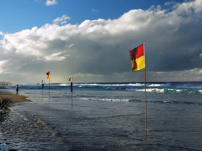

# Smooth and Sparse Optimal Transport

This repository proposes an implementation from scratch of the work realised in [this paper](https://arxiv.org/abs/1710.06276).
It mainly studies different relaxations of the Kantorovich problem in finite dimension, which I may recall is already in itself the 
relaxation of Monge problem. 

The application considered here is colour transfer, an image processing technique to 'transfer' the colours of a picture to another!

## Example 

Given a source and a reference image:

  

we can transport the colours of the first to the second!

 